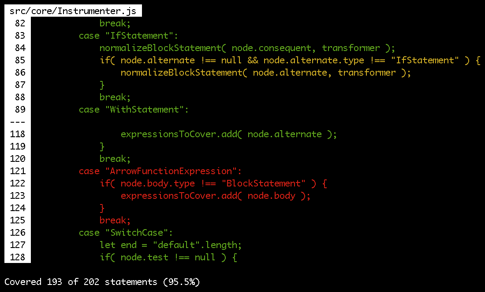

# slim-cover

[](https://travis-ci.org/tsbehlman/slim-cover) [](https://packagephobia.now.sh/result?p=slim-cover)


Barebones code coverage for JavaScript, in JavaScript.

Currently only supports Jasmine.



## Usage

```
slim-cover [...options]
```

Executes tests and prints coverage information.  `slim-cover` will only report on coverage for files that are included by your test code and satisfy the configuration options.  If there are `.js` files in your configuration that are not imported by either your tests or the code under test, coverage for those files will not be reported.

### Command line options

```
--project <directory>
```

Sets the project directory in which to execute tests.  For example, if your Jasmine `spec` folder is in a subdirectory called `dev`, run `slim-cover --project dev` to execute those tests.

By default, the current working directory is considered to be the project directory.

```
--include <file or directory>
```

Specifies a file or directory to include in the coverage report.  For example, `slim-cover --include index.js` will only report on code coverage for `index.js`, whereas `slim-cover --include src` will report on coverage for all `.js` files under the `src` directory.  This option can be used as many times as needed, for example `slim-cover --include index.js --include src`.

By default, all `.js` files under the project directory are included.

```
--exclude <file or directory>
```

Specifies a file or directory to exclude from the coverage report.  For example, `slim-cover --exclude node_modules` will report on code coverage for all `.js` files under the project directory except for those found under the `node_modules` directory.  This option can be used as many times as needed, for example `slim-cover --exclude spec --exclude benchmark.js`.

By default, nothing is excluded.

```
--reporter <type>[,<destination>]
```

Specifies a reporter to be used to output coverage information as well as an optional file to output to.  This option can be used as many times as needed, for example `slim-cover --reporter terminal --reporter codecov,coverage.json`.  Options for each reporter can only be specified via config file.

By default, the `terminal` reporter is outputted to stdout.  If a reporter is specified but not a destination, it is outputted to stdout.

```
--config <file>
```

Specifies the location of an optional configuration file.  By default, `slim-cover` will check for a config file called `.slim-cover.json`.

### Config file options

Options may also be specified via a configuration file.  When running `slim-cover` via command line it will use any file called `.slim-cover.json` in the current directory if it exists.

Here's an example with comments detailing the equivalent command line options described above:

```javascript
{
    "project": ".", // --project .
    "includes": [
        "src" // --include src
    ],
    "excludes": [
        "node_modules" // --exclude node_modules
    ],
    "reporters": [
        {
            "type": "terminal",
            "destination": "coverage.txt",
            "options": {
                "numContextLines": 2
            }
        } // --reporter terminal,coverage.txt
    ]
}
```

<a name="reporters"></a>
### Reporters

#### Terminal

The default reporter, which can be specified as `terminal` in your configuration.  The number of lines adjacent to lines without full coverage is configurable as `numConextLines` in this reporter's `options`.

#### Codecov

An optional reporter which can be used to create a report compatible with [codecov.io](https://codecov.io).  Can be specified as `codecov` in your configuration.

## Coverage for ES modules

`slim-cover` can be combined with `jasmine` and `esm` to test code written using ES modules.  Add `esm` as a helper in your `jasmine.json` (`"../node_modules/esm"` worked for me) and set the `"esm"` field to your `package.json` to `{ "cache": false }`.

Disabling this `esm` option is necessary because if `esm` caches your files before running `slim-cover` they will not be picked up when you run `slim-cover`.  Additionally, if `esm` caches your files while running `slim-cover`, you will get errors when not running `slim-cover` because it has not been initialized.
